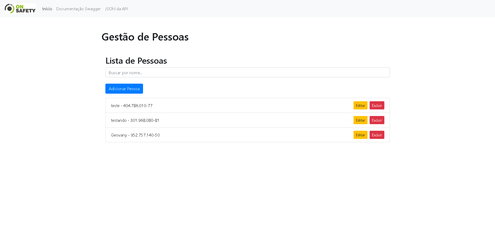
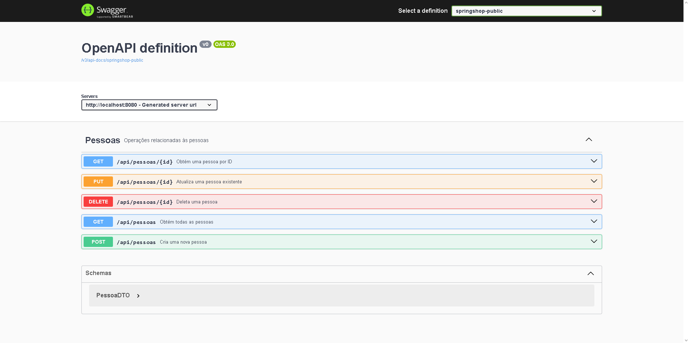

# Gestão de Pessoas

## Descrição

Este é um projeto completo para a gestão de pessoas, utilizando tecnologias modernas. O projeto inclui uma API REST construída com Spring Boot e uma aplicação frontend em React para interagir com a API.

## Tecnologias

- **Backend**: Spring Boot
- **Frontend**: React
- **Banco de Dados**: MySQL
- **Ferramenta de Construção**: Maven

## Funcionalidades

### API REST

A API permite realizar as seguintes operações de CRUD para o gerenciamento de pessoas:

- **Cadastro** de novas pessoas
- **Consulta** de informações de pessoas
- **Atualização** dos dados de uma pessoa
- **Exclusão** de uma pessoa

A API também inclui validação de CPF e regras de negócio. A documentação da API é fornecida pelo [Swagger](#swagger), que oferece uma interface interativa para explorar e testar os endpoints da API.

### Interface Web

A aplicação frontend em React oferece uma interface para:

- **Listar** todas as pessoas
- **Visualizar detalhes** de uma pessoa específica
- **Adicionar** uma nova pessoa
- **Atualizar** informações de uma pessoa
- **Excluir** uma pessoa

Abaixo está um exemplo da interface do frontend:



### Estrutura do Projeto

1. **Clone o repositório**:

    ```bash
    git clone https://github.com/Geovany-Gutierrez/Crud-Spring.git
    ```

2. **Estrutura do repositório**:

    - **`gestao-pessoas-backend`**: Contém o código fonte do backend (API REST).
    - **`gestao-pessoas-frontend`**: Contém o código fonte do frontend (aplicação React).
    - **`README.md`**: Documentação do projeto.

3. **Configuração do Backend**:

    - Navegue para o diretório `gestao-pessoas-backend` e siga as instruções para configurar e executar o backend.

4. **Configuração do Frontend**:

    - Navegue para o diretório `gestao-pessoas-frontend` e siga as instruções para configurar e executar o frontend.

## Instalação e Configuração

### Backend

1. Navegue para o diretório do projeto:

    ```bash
    cd gestao-pessoas-backend
    ```

2. Configure o banco de dados MySQL no arquivo `application.properties`:

    ```properties
    spring.datasource.url=jdbc:mysql://localhost:3306/pessoasdb
    spring.datasource.username=seu_usuario
    spring.datasource.password=sua_senha
    ```

3. Crie o banco de dados `pessoasdb` no MySQL:

    - **Abra o MySQL Workbench**.
    - **Conecte-se ao seu servidor MySQL** usando as credenciais apropriadas.
    - **Abra uma nova aba de consulta SQL**.
    - **Digite o seguinte comando SQL**:

      ```sql
      CREATE DATABASE pessoasdb;
      ```

    - **Execute o comando**.

4. Compile e execute o aplicativo:

    ```bash
    ./mvnw spring-boot:run
    ```

5. A API estará disponível em `http://localhost:8080/api/pessoas`. A documentação da API pode ser acessada em `http://localhost:8080/swagger-ui.html`.

### Frontend

1. Navegue para o diretório do projeto:

    ```bash
    cd gestao-pessoas-frontend
    ```

2. Instale as dependências:

    ```bash
    npm install
    ```

3. Execute a aplicação React:

    ```bash
    npm start
    ```

4. A interface estará disponível em `http://localhost:3000`.

## Swagger

O projeto utiliza o Swagger para documentar e testar a API. O Swagger fornece uma interface gráfica onde você pode explorar todos os endpoints da API e realizar testes diretamente do navegador.

- **Acesse o Swagger** em `http://localhost:8080/swagger-ui.html` após iniciar o backend.
  

